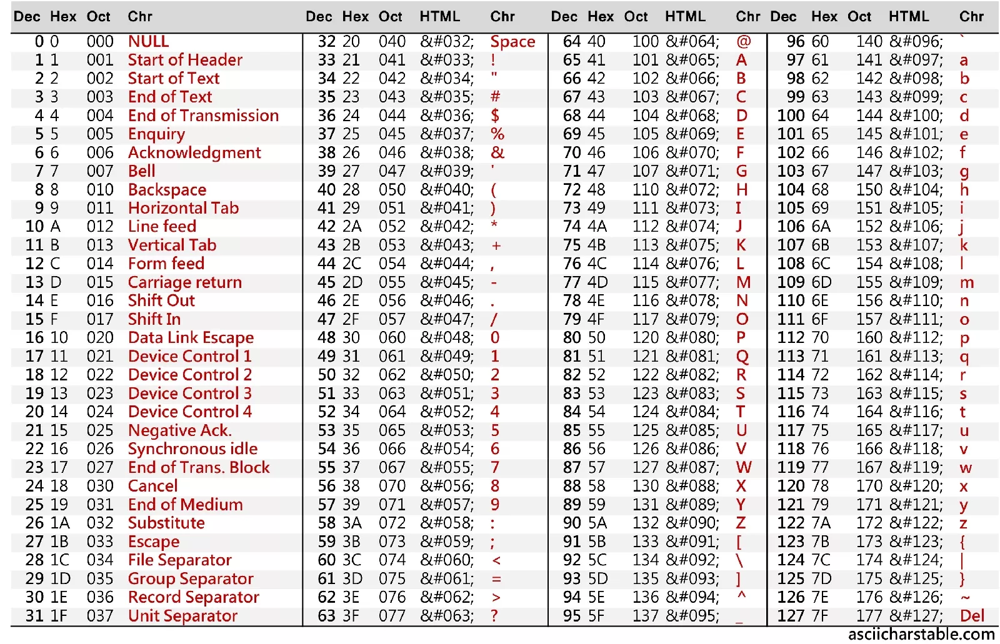

# Number Systems and Character Encodings

In this chapter, we will dive into the fundamental concepts of number systems and character encodings — a crucial foundation for everything you will encounter in the world of computers.

## Number Systems

### Digits and Bases

You are probably vaguely aware of the fact that there are different number systems and the same number can have a different representation in these number systems.

The most common number system is the decimal (base-10) number system which is what humans use for representing numbers.

However computers can't represent this many digits since they are usually designed by wiring elements together than can be on (1) or off (0).
Therefore computers represent numbers using the binary (base-2) number system internally.
Additionally, a lot of times (especially when dealing with cryptography and networking) we need the hexadecimal (base-16) number system.
Therefore, understanding how number systems work in general is crucial.

Different number system differ by the **digits** they use.
Digits are the individual units that you can use to "create" a number.

The **base** of a number system is the number of **digits** available in it.

For example, the decimal system has the digits `0`, `1`, `2`, `3`, `4`, `5`, `6`, `7`, `8`, `9`.
Therefore the base of the decimal system is `10`.

The binary system only has 2 digits, namely `0` and `1`.
Therefore the base of the binary system is `2`.

The hexadecimal system has base 16.
This leads to a problem - after all we only have 10 "conventional digits" (0-9).

The solution to this is simple - we use the letters `A-F` for the last digits.
The digits of the hexadecimal system are therefore `0`, `1`, `2`, `3`, `4`, `5`, `6`, `7`, `8`, `9`, `A` (for `10`), `B` (for `11`), `C` (for `12`), `D` (for `13`), `E` (for `14`), `F` (for `15`).

### Creating Numbers

How do we create a number in a number system?

Consider the number `7423` in the decimal system.
In high school you probably learned that each digit has a "place value".

For example the digit `3` is in the ones position and therefore has the place value `3`.
The digit `2` is in the tens position and therefore has the place value `2 * 10`, i.e. `20`.
The digit `4` is in the hundreds position and therefore has the place value `4 * 100`, i.e. `400`.
Finally, the digit `7` in in the thousands position and therefore has the place value `7 * 1000`, i.e. `7000`.

The "value" of the number `7423` is then the sum of all the place values of the digits, i.e.

```
3 + 20 + 400 + 7000 = 7423
```

In the decimal system you don't actually need to laboriously compute the value of the number to get it - you can simply look at the number itself.

However, in the binary system it is different.
Consider the number `1101` in the binary system.

Here each digit also has a position, but the place values are computed differently.
The multipliers are no longer powers of ten (i.e. `1`, `10`, `100` and `1000`), but powers of two (i.e. `1`, `2`, `4` and `8`).

In our example we have a digit `1` in the ones position - it has the place value `1`.
The digit `0` is in the "twos" position and therefore has the place value `0 * 2`, i.e. `0`.
The next digit `1` is in the "fours" position and therefore has the place value `1 * 4`, i.e. `4`.
Finally, the digit `1` in in the "eights" position and therefore has the place value `1 * 8`, i.e. `8`.

Therefore the value of the number `1101` would be:

```
1 + 4 + 8 = 13
```

How could we approach this for an arbitrary number and number system?

Looking at our examples we see that the value of a number is the sum of its place values:

```
V = p_0 + p_1 + ... + p_n
```

where p_i is the place value of the ith digit.

Each place value is computed by multiplying the digit with the corresponding multiplier.
It is easy to see that the multiplier is simply the base raised to the power of the position of the digit.

You therefore calculate the value of a number in any given number system via the following formula:

```
V = d_0 * b^0 + d_1 * b^1 + ... + d_n * b^n
```

In this formula:

- `V` represents the value of the number
- `n` is the number of digits in the number (for example the number `7423` has 4 digits)
- `d_i` is the digit in the i-th position from the right (0-indexed), for example given the number `7423`, `d_1` would be `2` and `d_2` would be `4`
- `b` is the base of the number system

Let's apply this formula to the our examples.

First, we will calculate the value of `7423` in base `10`.

Here we have `n = 4` (since we have 4 digits).
The digits are `d_0 = 3`, `d_1 = 2`, `d_2 = 4` and `d_3 = 7`.
And since the base is `b = 10` the multipliers will be `b^0 = 10^0 = 1`, `b^1 = 10^1 = 10`, `b^2 = 10^2 = 100` and `b^3 = 10^3 = 1000` respectively.

Therefore we get:

```
V = d_0 * b^0 + d_1 * b^1 + d_2 * b^2 + d_3 * b^3 = 3 * 1 + 2 * 10 + 4 * 100 + 7 * 1000 = 7423
```

Second, let's calculate the value of `1101` in base `2`.

Here we have `n = 4` (since we have 4 digits).
The digits are `d_0 = 1`, `d_1 = 0`, `d_2 = 1` and `d_3 = 1`.
And since the base is `b = 2` the multipliers will be `b^0 = 2^0 = 1`, `b^1 = 2^1 = 2`, `b^2 = 2^2 = 4` and `b^3 = 2^3 = 8` respectively.

Therefore we get:

```
V = d_0 * b^0 + d_1 * b^1 + d_2 * b^2 + d_3 * b^3 = 1 * 1 + 0 * 2 + 1 * 4 + 1 * 8 = 13
```

As you might have already guessed the binary system is not really human readable, especially because it needs much more space than the corresponding decimal number.

Therefore we often represent digital data using the hexadecimal system.
The general formula for calculating values of hexadecimal numbers is the same as for every other number system.

Consider the number `5fa8`:

```
V = d_0 * b^0 + d_1 * b^1 + d_2 * b^2 + d_3 * b^3 = 8 * 1 + 10 * 16 + 15 * 16^2 + 5 * 16^3 = 24488
```

The reason we represent digital data using the hexadecimal and not the decimal number system is because the corresponce between base 16 and base 2 is much nicer than between base 10 and base 2.
This is because you represent the numbers `0` to `15` using either one hexadecimal digit (`0` to `F`) or four binary digits (`0000` to `1111`).

This means that one byte (eight bits) can be represented using two hexadecimal numbers.

We have introduced the most common number systems:

- `base-10` - the ones humans use
- `base-2` - this is how computers actually represent digital data
- `base-16` - a smaller and more readable representation for digital data

The are numerous other number systems like the base 8 number system, also called the octal system (which is sometimes used).
And if you think about it, via the method from above you can construct various other systems like base 6 or base 11, but those do not have real pratical applications.

## Unicode

In the previous chapter, we explored how numbers used by humans are represented inside a computer and how to
programmatically convert from the computer's binary representation to the decimal system that we are all familiar with.
However, you're likely reading this text not as a series of numbers, but as meaningful text.
So, how do we go from numbers to text?

To bridge this gap, we need a system that assigns a unique number to each character.
In the early days of computing, systems like ASCII (American Standard Code for Information Interchange) were developed, but they were limited to representing a small set of characters (mostly English letters, digits and some other things).

### ASCII

Here how an ASCII table looks like:



Basically, an ASCII table is a 1 to 1 mapping of a number to a specific character.

Whenever it looks like we are working with a character, with are really working with it's corresponding number and the computer neatly pretends as if the number was the character.

Let's say you have a text file with the sentence: `Hello world!`.
Try to find the representation of this sentence in ASCII using hex numbers:

```
Hello, world!
```

The solution is

```
48 65 6C 6C 6F 2C 20 77 6F 72 6C 64 21
```

Or - in binary:

```
01001000 01100101 01101100 01101100 01101111 00101100 00100000 01110111 01101111 01110010 01101100 01100100 00100001
```

> This is the moment where you realize why we usually write things in the hexadecimal representation and not in the binary representation.

The ASCII system was very clean and nice, but very quickly programmers realized that the English language is not only language in the world.
Soon, the limitations of ASCII became apparent.
Different languages, with their unique characters and symbols, could not be adequately represented.
This limitation led to the development of Unicode, a universal character encoding system.

> This is an extremely shortened "history" of Unicode.
> In reality there were a lot of standards in between.
> However, nowadays pretty much everyone uses Unicode and since this is a book about Linux and not the history of Linux, we will gloss over them.

### Unicode

So what is Unicode?

The most important part of Unicode is another 1 to 1 mapping between characters and numbers.

This is similar to ASCII, except that the character table is _giant_ - version 15.1 defines 149813 (!) characters including constructs like emojis.

Such a number is called a **code point**.

The entire set of code points is divided into 17 **character planes**, each consisting of 65,536 code points.
These planes are indexed from 0 to 16.

The plane 0 is called the **Basic Multilingual Plane** (BMP for short) and ranges from `U+0000` to `U+FFFF`.
It contans the most commonly used characters, including most characters from the most common modern languages, punctuation, and many symbols.
Most of the characters that you encounter in everyday text are in the BMP.

Planes 1 to 16 are the **supplementary planes** and range from `U+010000` to` U+10FFFF`.
They include less commonly used characters, historic languages, various symbols, and emojis.
For example, Plane 1 is the **Supplementary Multilingual Plane** (SMP for short), which includes ancient languages and emoji characters.

Importantly, a Unicode code point is an abstract number and doesn't directly specify how that number is actually stored in a computer's memory.
This job is managed by **encodings**.

The Unicode standard itself defines three encodings - `UTF-8`, `UTF-16` and `UTF-32`.

#### UTF-8

UTF-8 (8-bit Unicode Transformation Format) is a variable-length encoding that can use 1 to 4 bytes for each character.
It's designed to be backward compatible with ASCII, which means that the first 128 characters in Unicode (which correspond to standard ASCII characters) are represented in UTF-8 using exactly the same single byte, making it efficient for English and other Latin-based languages.

Examples:

- Character `A` (code point `U+0041`): In UTF-8, `A` is represented as 41 in hexadecimal, which is the same as its
  ASCII representation.
- Character `€` (code point `U+20AC`): This character is beyond the ASCII range and is encoded in
  UTF-8 as `E2 82 AC` in hexadecimal, using three bytes.

#### UTF-16

UTF-16 (16-bit Unicode Transformation Format) uses 2 bytes for most characters but extends to 4 bytes for characters outside the Basic Multilingual Plane (more on this in a minute).
It is often more efficient than UTF-8 for files that require a large number of non-Latin characters.

Examples:

- Character `A` (code point `U+0041`): In UTF-16, `A` is represented as `00 41` in hexadecimal, using two bytes.
- Character `𐐷` (Deseret Capital Letter Ew, code point `U+10437`): This character is in a supplementary plane
  and is encoded in UTF-16 as a surrogate pair `D801 DC37` in hexadecimal, using four bytes.

In the UTF-16 encoding, characters outside the BMP require a special encoding mechanism known as surrogate pairs.
A surrogate pair consists of two 16-bit code units: a high surrogate and a low surrogate.

Surrogate Ranges

- High Surrogates: Range from U+D800 to U+DBFF (1,024 possible values).
- Low Surrogates: Range from U+DC00 to U+DFFF (1,024 possible values).

To encode a character outside the BMP using surrogate pairs, the following steps are taken:

- Subtract 0x10000 from the character's Unicode code point. This aligns the code point to the start of the supplementary planes.
- Represent the result as a 20-bit binary number.
- Split this 20-bit number into two parts: the high 10 bits and the low 10 bits.
- Add the high 10 bits to 0xD800 to get the high surrogate.
- Add the low 10 bits to 0xDC00 to get the low surrogate.

For example, here is how we would encode the '𐐷' character (U+10437):

- Subtract 0x10000 from U+10437:
  U+10437 - U+10000 = U+00437

- Represent U+00437 as a 20-bit binary number:
  U+00437 in binary is 0000 0100 0011 0111.

- Split into high and low 10 bits:
  High 10 bits: 0000 0100 00 (binary) = 0x0040 (hexadecimal)
  Low 10 bits: 11 0111 (binary) = 0x0037 (hexadecimal)

- Calculate the high surrogate:
  0xD800 + 0x0040 = 0xD840

- Calculate the low surrogate:
  0xDC00 + 0x0037 = 0xDC37

Therefore, the UTF-16 encoding of '𐐷' (U+10437) is the surrogate pair 0xD840 0xDC37.

Try encoding `😊` (U+1F60A) using surrogate pairs (the result should be `0xD83D 0xDE0A`).

#### UTF-32

UTF-32 (32-bit Unicode Transformation Format) is a Unicode encoding that uses a fixed length of four bytes (32 bits) for every character.
Unlike UTF-8 and UTF-16, which are variable-length encodings, UTF-32 has the characteristic of using a consistent length for all characters, making it simpler in terms of understanding and handling character encoding.

Let's take the character 'A' (U+0041) as an example:

In UTF-32, 'A' is represented as 00 00 00 41 in hexadecimal.
The Unicode code point U+0041 is directly placed in the 32-bit unit, with leading zeros to fill the four bytes.

Another example is the character '😊' (U+1F60A):

In UTF-32, '😊' is represented as 00 01 F6 0A in hexadecimal.
The Unicode code point U+1F60A is directly placed in the 32-bit unit, again with leading zeros.
